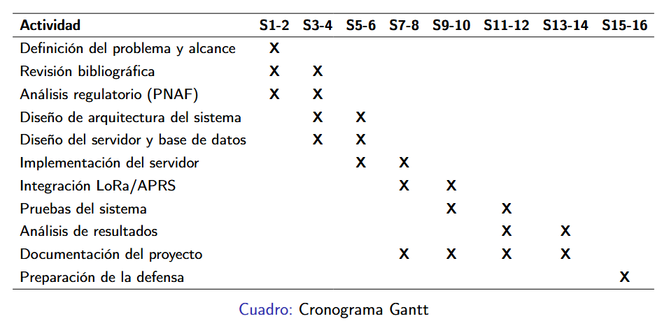

# Taller-Integrador-Servidor-APRS-Trackdirect

Repositorio para el Proyecto correspondiente al curso de Taller Integrador con temática Servidor APRS Trackdirect

Gantt inicial del proyecto




# Instalar VirtualBox y crear una máquina virtual con Ubuntu Server LTS.

Se creó correctamente una máquina virtual en VirtualBox con **Ubuntu Server LTS**.
Iniciando con la descarga del Ubuntu server desde la página oficial de ubuntu para la configuración dentro del VirtualBox, también se descargó el VirtualBox
Primero se instalaron dependencias necesarias:
```bash
sudo apt update
sudo apt install -y build-essential dkms linux-headers-$(uname -r)
```
Luego se instaló el paquete .deb de VirtualBox descargado previamente:
```bash
cd ~/Downloads
sudo apt install ./virtualbox-*.deb
```
Una vez instalada la máquina virtual con Ubuntu Server, se actualizó el sistema:
```bash
sudo apt update
sudo apt upgrade -y
sudo reboot
```
**Dentro del VirtualBox**
- Pulsa **New**
- En name se escribe **Ubuntu Server**
- En ISO se selecciona la imagen que descargamos anteriormente de Ubuntu Server
- Luego en **Type** Linux y **Versión** Ubuntu (64 bit)
- Desmarca la opción de instalación automática, que suele salir como:
Proceed with Unattended Installation

**Asignación de recursos de la VirtualBox**
- Ram de 2048MB, CPU 2 y un disco de 20GB
- Se deja EFI desmarcado si no te lo piden específicamente.

**Luego se inicia la máquina virtual**
- Se selecciona el idioma
- Se selecciona el idioma del teclado
- Install Ubuntu Server
****

## Clonación de Maquina Virtual

Para replicar el entorno de trabajo entre los integrantes del equipo, se utilizó un archivo en formato .ova, el cual ya contenía la máquina virtual completamente configurada. Este formato permitió evitar la instalación manual del sistema operativo y redujo considerablemente el tiempo de preparación del entorno.

El proceso inició abriendo Oracle VirtualBox en el equipo local. Desde el menú principal, se accedió a la opción “Archivo → Importar servicio virtualizado”, donde se seleccionó el archivo .ova previamente proporcionado. Al cargarlo, la herramienta mostró una vista general de la configuración de la máquina virtual, lo que permitió verificar que los recursos asignados fueran adecuados para el equipo anfitrión.

Una vez revisada esta información, se procedió con la importación. Durante este proceso, VirtualBox se encargó automáticamente de descomprimir el archivo, generar el disco virtual correspondiente y registrar la máquina dentro del sistema. Este paso tomó algunos minutos, dependiendo del tamaño del archivo y del rendimiento del equipo.

Al finalizar, la máquina virtual quedó disponible en el panel principal de VirtualBox. A partir de ese momento, se pudo iniciar normalmente y utilizar el entorno ya configurado, lo que facilitó continuar con las siguientes etapas del proyecto sin necesidad de configuraciones adicionales desde cero.

Como resultado, se logró clonar exitosamente la máquina virtual, asegurando que todos los miembros del equipo trabajaran sobre un entorno consistente y funcional.


# Instalar Webmin para la administración gráfica del servidor.

Para la administración remota del servidor se utilizó Webmin, una herramienta basada en web que permite gestionar servicios, usuarios y configuraciones del sistema de forma gráfica. El proceso de instalación requirió un enfoque alternativo debido a incompatibilidades con el método tradicional en versiones recientes de Ubuntu.

Inicialmente, se intentó realizar la instalación utilizando el repositorio oficial mediante `apt`. Sin embargo, este método falló debido a errores de verificación de firma (GPG), ya que el repositorio de Webmin utiliza algoritmos de firma que han quedado obsoletos y son rechazados por Ubuntu 24. Esto impedía que el sistema confiara en el origen del paquete, bloqueando su instalación.

Como solución, se optó por instalar Webmin directamente desde su paquete oficial en formato `.deb`. Para ello, primero se descargó el archivo desde el repositorio oficial en SourceForge:

```bash
wget https://prdownloads.sourceforge.net/webadmin/webmin_2.105_all.deb
```

Una vez descargado el paquete, se procedió con su instalación utilizando la herramienta `dpkg`:

```bash
sudo dpkg -i webmin_2.105_all.deb
```

Durante este proceso, el sistema reportó la falta de algunas dependencias necesarias para completar la instalación. Este comportamiento es esperado al instalar paquetes manualmente. En lugar de instalar cada dependencia de forma individual, se utilizó el siguiente comando para que el propio sistema resolviera automáticamente todos los paquetes faltantes:

```bash
sudo apt -f install -y
```

Este paso permitió completar correctamente la instalación de Webmin junto con todas sus librerías requeridas.

Posteriormente, se verificó el estado del servicio para confirmar que Webmin estuviera activo y funcionando correctamente:

```bash
sudo systemctl status webmin
```

El servicio se encontró en estado `active (running)`, lo que confirmó que la instalación fue exitosa. En caso de que no se inicie automáticamente, se puede iniciar manualmente con:

```bash
sudo systemctl start webmin
```

Una vez en ejecución, Webmin queda disponible a través de su interfaz web. Para acceder, se utilizó un navegador web desde la máquina host, ingresando a la siguiente dirección:

```
https://<IP-del-servidor>:10000
```

Es importante tener en cuenta que Webmin utiliza un certificado autofirmado por defecto, por lo que el navegador mostrará una advertencia de seguridad. Esta advertencia es esperada en entornos de prueba o desarrollo, y se puede omitir accediendo a las opciones avanzadas del navegador y continuando al sitio.

Finalmente, se inició sesión utilizando las credenciales del sistema operativo (usuario y contraseña creados durante la instalación de Ubuntu). Con esto, se obtuvo acceso completo al panel de administración de Webmin.

En conclusión, debido a las restricciones de seguridad en versiones modernas de Ubuntu, la instalación de Webmin se realizó mediante el uso del paquete `.deb`, lo que permitió evitar problemas de firma y completar la configuración de forma exitosa. Esta herramienta quedó operativa para la gestión remota del servidor, cumpliendo con los requerimientos del proyecto.


# Instalar y configurar el servicio aprsc y configurar aprsc para recibir el tráfico del iGate de prueba (TI3WTI-10)

Para la implementación del backend del sistema se utilizó APRSC (APRS Server Core), el cual permite la recepción, procesamiento y distribución de paquetes APRS dentro de la red. Este servicio es fundamental para el funcionamiento del sistema, ya que actúa como el núcleo de comunicación entre los clientes e iGates.

Inicialmente, se procedió con la instalación del servidor APRSC en el entorno Ubuntu Server. Durante este proceso, fue necesario resolver dependencias del sistema para garantizar una instalación correcta del servicio. Una vez completada la instalación, se verificó la disponibilidad del ejecutable y los archivos de configuración asociados.

Posteriormente, se realizó la configuración del servidor mediante la edición del archivo `aprsc.conf`, en el cual se definieron los parámetros principales de operación del sistema. Entre los aspectos más relevantes configurados se encuentran:

- Identificación única del servidor mediante el parámetro `ServerId`
- Información del administrador (`MyAdmin`) y correo de contacto (`MyEmail`)
- Configuración de puertos para clientes APRS (14580)
- Habilitación del servicio de monitoreo HTTP (14501)
- Definición de listeners para la recepción de tráfico en diferentes modos (fullfeed, igate, udpsubmit)

Ejemplo de configuración utilizada:

ServerId   TI3WTI-10
MyAdmin    "Kendall Madrigal, TI3WTI-10"
MyEmail    kendallmacampos2941@estudiantec.cr

Listen "Client-Defined Filters" igate tcp :: 14580
HTTPStatus 0.0.0.0 14501


Una vez configurado el servidor, se procedió a validar su funcionamiento mediante la ejecución del servicio y la verificación de su estado:


